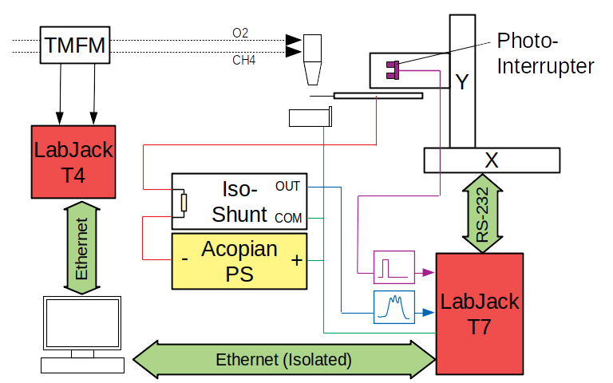
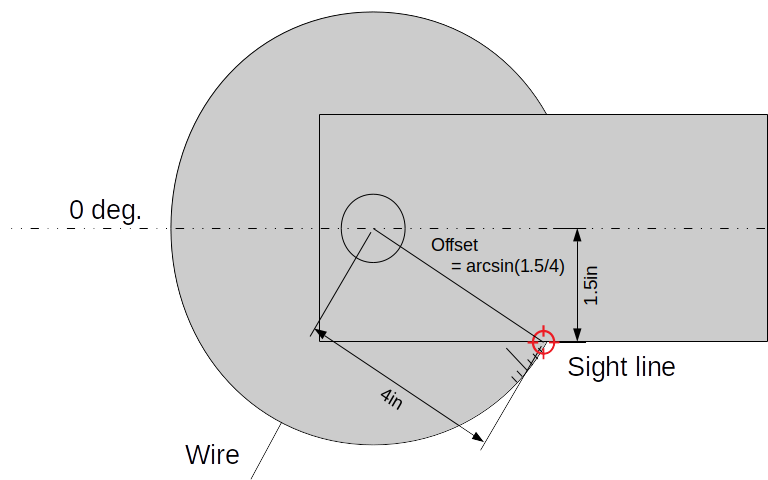

# wscan.py

`wscan.py` automates a single horizontal scan of the flame.  The script prompts the user to enter parameters and then alternates between data collection and small incremental motion of the horizontal translation stage.  The results of a single horizontal scan are gathered into a single directory in `data`, so that all files in a directory represent data collected at different disc locations, but all at the same vertical location.

[Experiment](#experiment)
[User prompts](#prompts)
[Data acquisition](#data)

## <a name=experiment></a> Experiment

Detailed description of the behavior of `wscan.py` requires some explanation of the physical experiment.  Figure 1 shows a digram of the entire experiment.


**Figure 1** Experimental diagram

A spinning disc is mounted on a two-axis translation stage system.  Data acquisition and control of the translation stages is provided by a LabJack T7.  The disc is biased by an Acopian linear power supply, and current is measured by a precision shunt circuit.  A photointerrupter is mounted around a hole in the shaft supporting the spinning disc, so that it produces two pulses per rotation.

A separate T4 DAQ reads analog signals from Teledyne-Hastings thermal mass flow meters, which monitor the oxygen and methane flow rates to the torch.

It should be emphasized here that the x- and y-axes used by the translation stages are not the same x-, y-, and z-axes used as torch coordinates when presenting the results.

## <a name=prompts></a> User prompts

The `wscan.py` script prompts the user to enter a series of parameters that are used to automate the data collection process.  They are as follows:

**_(1) Enter the disc angle observed under the front edge of the platform at the rising edge of the photointerrupter._**

The disc is etched with 360 degree markings, and the wire is presumed to have been carefully placed at the 0-degree mark.  When the disc is manually rotated so that the disc is precisely at a rising edge of the photointerrupter, it is possible to sight along the edge of the disc's support to read the degree graduations to within about 0.5 degrees, as shown in Figure 2.

The value entered by the user indicates the angle from this point to the location of the wire.  `wscan.py` merely adjusts this value by a `disc_offset_angle` based on the known location of that edge as 180 degrees plus the arcsine of 1.5/4.  In this context, center is taken as when the wire is protruding directly parallel to the translation stage's x-axis, also shown in Figure 2.


**Figure 2** Method for sighting the wire position at the photointerrupter rising edge.

**_(2) Enter the wire length extending radially beyond the disc edge._**

This prompt should be relatively self-explanatory.  It is used to establish the radius of the wire tip from the center of disc rotation.  The radius of the disc is taken to be precisely 4 inches.

**_(3) Enter the disc direction of rotation_**

If the disc direction of rotation were reversed, then the post-processing methods for calculating disc location would all be inverted.  This bit allows the post-processing algorithms to be warned.

**_(4) Enter the power supply voltage._**

This is the bias voltage provided by the Acopian power supply to bias the wire.  In most tests, it was 20V, but not all.  This is an important parameter in the model to calculate calibrated ion density from the wire current signals.

**_(5) Enter the torch standoff from the work._**

Standoff distance defines the size of the flame domain, and is essential when relating electric fields to voltages.

**_(6) Enter the distance from the torch tip in mm.  The torch tip is y=0, and the work is in the positive direction.  This will be used to position the torch._**

This parameter is actually used to command the y-axis of the translation stage.  The assumption is that prior to beginning the experiment, the user has initialized the translation stages such that y=0 when the wire just barely makes electrical contact with the torch (easily detected), and x=0 corresponds to the wire tip passing roughly above the outermost edge of the work piece (safely outside of the flame).

**_(7) Who is entering these data?_**

User initials are used to record the responsible lab personnel if there are questions about the data later.

**_(8) Is this correct?_**

The operator is intended to review all of their entries in the terminal to verify that they are correct.  If the user enters 'n'o, then the entry process will begin again.

## <a name=data></a> The data acquisition process

First, `wscan.py` creates a directory in `../data/` named with a timestamp representing the start of the data acquisition process.  All data are placed in that directory.  All data collection are performed using the `lcburst` utility compiled from the [lconfig](https://github.com/chmarti1/lconfig) system.  Post processing is performed using the included `lconfig.py` module.

Before and after the scan, the flow rates are measured and recorded in files named `flow.pre` and `flow.post`.  The flow measurement process is configured using the `flow.conf` file found in the `bin` directory alongside `wscan.py`.  These redundant pre- and post-measurement flow rate measurements are useful to ensure that no drift in the operating condition occurred during the experiment.

The disc is moved to its initial x,y location, and a brief pause is taken to allow any vibration to settle out.  Motion is performed using custom `movexy`, `movex`, or `movey` command line utilities specially authored to command motion through the Labjack T7 UART interface.

This disc is moved through a series of incremental horizontal positions in and out of the flame, defined by parameters set near the top of the `wscan.py` script:

```python
x_start = 0.0
x_stop = 20.0
x_step = .125
```

In this configuration, the disc will move 20mm deep in 1/8mm increments.  However, half of these locations are recorded with increasing x-positions and half are recorded with decreasing x-positions so that any hysteresis will be obvious.

Data are collected at each position by issuing the appropriate `movexy` command, pausing for 1 second to allow the system to settle, and then issuing an `lcburst` command to perform the data acquisition.  The measurement process is configured by the `wscan.conf` file, which resides in the `bin` directory alongside `wscan.py`.

Data acquisition is intended to include two channels: one analog channel indicating the wire current signal, and one digital channel indicating the photointerrupter state.  With the assumption that the disc speed is quite stable, this is sufficient information to fully resolve the pedestal signal with interpolated disc angles at all moments in time.

Each individual measurement results in a new `.dat` file, which is numbered sequentially.  The meta data in the files are described in the [data.md](data.md) documentation.